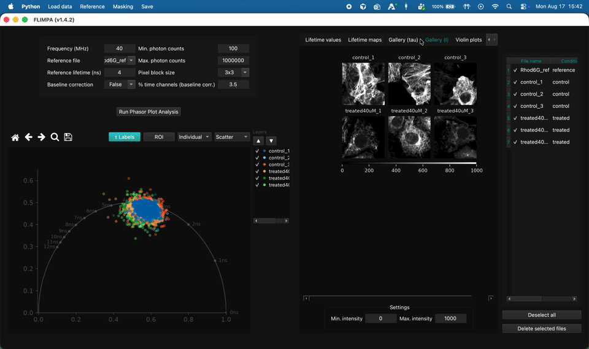
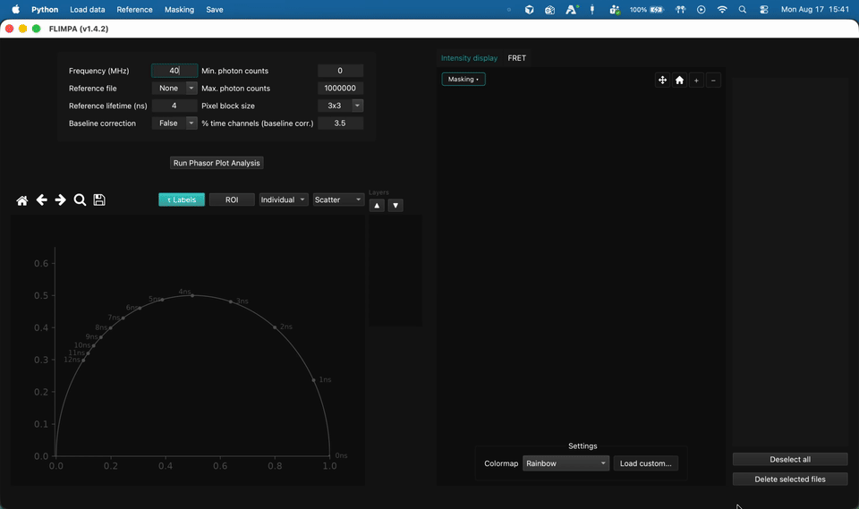
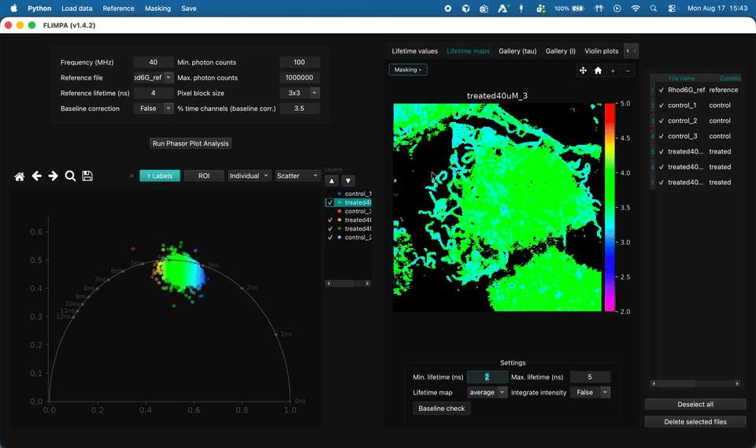
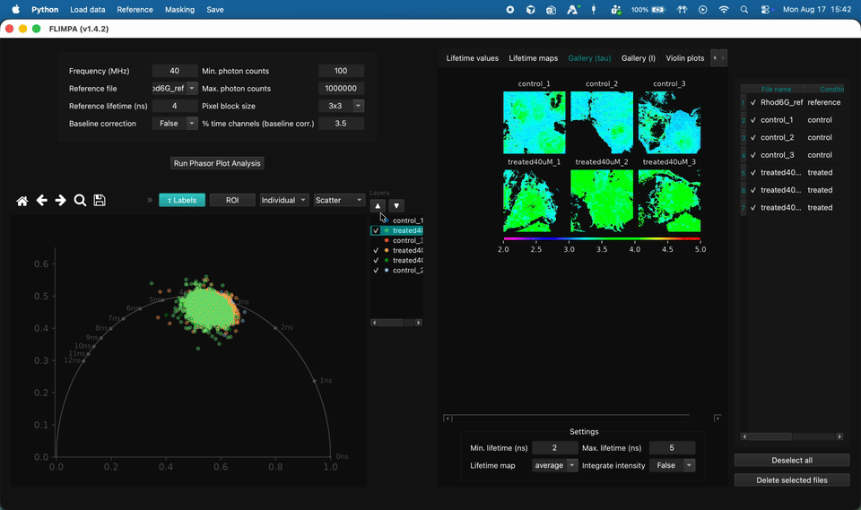
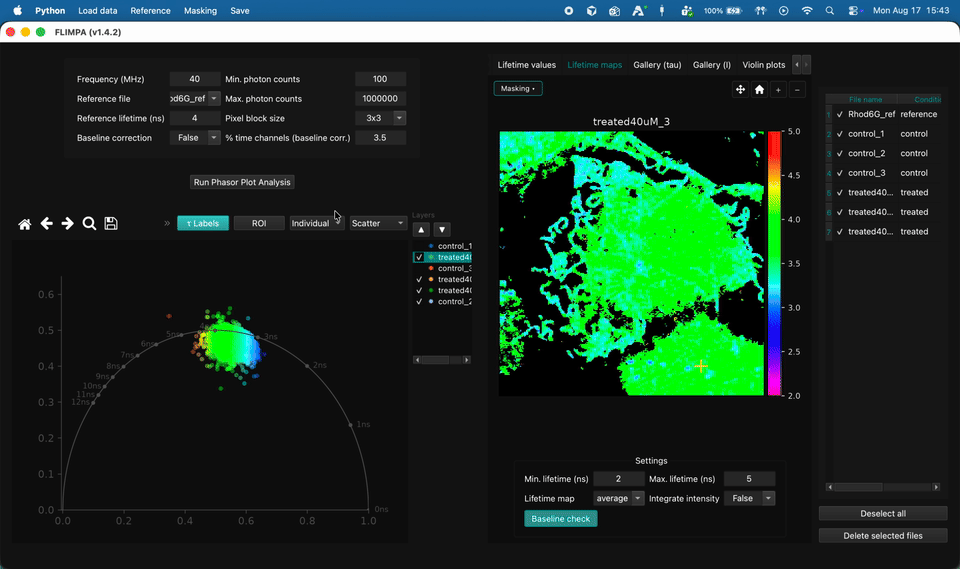

<div align="center">
  
</div>

# FLIMPA 2.0.0

**FLIMPA** is an open-source app for phasor-plot analysis of raw Time-Correlated Single Photon Counting (TCSPC) Fluorescence Lifetime Imaging Microscopy (FLIM) data.

This repository is **FLIMPA 2.0.0** — a modified build based on [upstream FLIMPA v1.4.2](https://github.com/SofiaKapsiani/FLIMPA/releases/tag/v1.4.2). It keeps the core phasor workflow and adds in-app masking, FRET maps, baseline-check decay curves, colour maps, export options, and UI updates documented below.

This version was written post-publication by Lev Gerasimov as part of a summer project with the Molecular Neuroscience Group at the University of Cambridge. To run the software, please download the corresponding [`.exe`](https://github.com/levontiiy/Flimpa---modifications/releases/download/v2.0.0/FLIMPA_v2.0.0.exe) file for Windows or the [`.dmg`](https://github.com/levontiiy/Flimpa---modifications/releases/download/2.0.0/FLIMPA.v2.0.0.dmg) file for Mac. Please cite the following reference if you used this software in your research:

> **FLIMPA: A Versatile Software for Fluorescence Lifetime Imaging Microscopy Phasor Analysis**, published in *Analytical Chemistry*  
> Sofia Kapsiani, Nino F Läubli, Edward N. Ward, Mona Shehata, Clemens F. Kaminski, Gabriele S. Kaminski Schierle  
> [Molecular Neuroscience Group](https://www.ceb-mng.org/) and [Laser Analytics Group](https://laser.ceb.cam.ac.uk/) (University of Cambridge)

[[FLIMPA 2.0.0 (this fork)](https://github.com/levontiiy/Flimpa---modifications/releases/tag/v2.0.0)] [[upstream FLIMPA 1.4.2](https://github.com/SofiaKapsiani/FLIMPA/releases/tag/v1.4.2)] [[paper](https://pubs.acs.org/doi/10.1021/acs.analchem.5c00495)] [[user manual 2.0.0 (Word)](https://github.com/levontiiy/Flimpa---modifications/blob/main/docs/FLIMPA_2.0.0_User_Manual.docx)] [[user manual 2.0.0 (PowerPoint)](https://github.com/levontiiy/Flimpa---modifications/blob/main/docs/FLIMPA_2.0.0_User_Manual_Presentation.pptx)] [[user manual (PDF, upstream)](https://pubs.acs.org/doi/suppl/10.1021/acs.analchem.5c00495/suppl_file/ac5c00495_si_002.pdf)] [[citation](#citation)]

## Features

<div align="center">
  
</div>

### Core analysis (from FLIMPA 1.4)

- Phasor plot generation and analysis (single file, by condition, scatter / histogram / contour)
- Fluorescence lifetime and intensity map visualisation
- ROI selection on the phasor plot (ellipse), saved as a mask for analysis
- Gallery plots of fluorescence lifetime and intensity maps
- Violin plot analysis
- Table of mean fluorescence lifetime values per image (group by condition or sample)
- Import `.sdt`, `.ptu`, and `.tif` stacks; reference correction; optional IRF overlay

### Added in FLIMPA 2.0.0

- **Manual masking** on intensity / lifetime / FRET images — polygon, lasso, brush, delete region, eraser (with adjustable brush/eraser size 1–30 px); mask import/export as labelled uint16 TIFF
- **Mask save** menu — save manual (polygon) or phasor ROI masks; clear mask for selected file
- **FRET efficiency maps** — `E = 1 − τ / τ_D`; FRET tab appears after analysis (rightmost tab)
- **Baseline check** — click a pixel on the lifetime map to inspect the decay curve (log scale, map τ curve, IRF overlay, t₀ crop)
- **Lifetime colour map** presets and custom colour map loading (CSV/TXT or colour-strip image)
- **Phasor plot** — **G** and **S** axis labels; **Layers** list on gallery phasor plots (show/hide files, reorder)
- **Image navigation** — pan, zoom, and reset on intensity, lifetime, and FRET views
- **Save data** menu — export lifetime maps, galleries, phasor/violin plots, lifetime table CSV, and **Export phasor points (G,S)...** (choose file from list → CSV with G, S, row, col for non-zero pixels)
- **macOS app** — `FLIMPA.v2.0.0.dmg` via [Releases](https://github.com/levontiiy/Flimpa---modifications/releases/tag/2.0.0)
- **Windows app** — single-file `FLIMPA_v2.0.0.exe` via [Releases](https://github.com/levontiiy/Flimpa---modifications/releases/tag/v2.0.0)
- **User manual** — [Word](https://github.com/levontiiy/Flimpa---modifications/blob/main/docs/FLIMPA_2.0.0_User_Manual.docx) and [PowerPoint](https://github.com/levontiiy/Flimpa---modifications/blob/main/docs/FLIMPA_2.0.0_User_Manual_Presentation.pptx) (in this repo under `docs/`)
- PyInstaller build scripts for macOS (`.dmg`) and Windows (single `.exe`)

---

# Installation/Download — FLIMPA 2.0.0

## Download and Run from release

Download builds from [Releases v2.0.0](https://github.com/levontiiy/Flimpa---modifications/releases/tag/v2.0.0):

| Platform | File |
|----------|------|
| macOS | [`FLIMPA.v2.0.0.dmg`](https://github.com/levontiiy/Flimpa---modifications/releases/download/2.0.0/FLIMPA.v2.0.0.dmg) |
| Windows | [`FLIMPA_v2.0.0.exe`](https://github.com/levontiiy/Flimpa---modifications/releases/download/v2.0.0/FLIMPA_v2.0.0.exe) |

**User manuals (in the repository, not release assets):** [Word](https://github.com/levontiiy/Flimpa---modifications/blob/main/docs/FLIMPA_2.0.0_User_Manual.docx) · [PowerPoint](https://github.com/levontiiy/Flimpa---modifications/blob/main/docs/FLIMPA_2.0.0_User_Manual_Presentation.pptx)

### macOS

1. **Download** **`FLIMPA.v2.0.0.dmg`** from [Releases v2.0.0](https://github.com/levontiiy/Flimpa---modifications/releases/tag/2.0.0).
2. **Open the disk image** — double-click `FLIMPA.v2.0.0.dmg`. A Finder window titled **FLIMPA 2.0.0** opens (this is the installer disk, not the app itself).
3. **Install** — drag **FLIMPA** to **Applications**.
4. **Eject** the disk image (right-click the **FLIMPA 2.0.0** volume → **Eject**).
5. **Launch** — open **Applications → FLIMPA** (or use Spotlight).

**Gatekeeper (unsigned build):** macOS may block the first launch and show a warning that the app is from an unidentified developer or “damaged”. This is expected for an unsigned release.

6. If FLIMPA does not open, go to ** → System Settings → Privacy & Security**, scroll down, and click **Open Anyway** next to the FLIMPA message.
7. Launch **FLIMPA** again from Applications and confirm **Open**.

Alternatively, **right-click** `FLIMPA` in Applications → **Open** → **Open** (works the first time without using System Settings).

If you still see “damaged”, run in Terminal:

```bash
xattr -cr /Applications/FLIMPA.app
codesign --force --deep -s - /Applications/FLIMPA.app
```

Then open FLIMPA again.

### Windows

1. **Download** **`FLIMPA_v2.0.0.exe`** from [Releases v2.0.0](https://github.com/levontiiy/Flimpa---modifications/releases/tag/v2.0.0).
2. **Run** the file (double-click). No separate installer folder is required — this is a single-file build.
3. On first launch, Windows SmartScreen may warn that the app is unrecognised. Click **More info** → **Run anyway** (unsigned release).

If antivirus quarantines the `.exe`, restore it or add an exception — PyInstaller apps are often flagged on first download.

---

## Install from source

Needs **Python 3.11 or newer**, **pip**, and internet once (to download packages). Works on macOS, Windows, and Linux.

To build standalone apps yourself, use **PyInstaller** (listed in `requirements.txt`). Run `bash scripts/build_release.sh 2.0.0` from the project root (macOS → `.dmg`). On Windows, run `pyinstaller --noconfirm FLIMPA.spec` to produce a single-file `dist\FLIMPA.exe`.

**Publishing:** attach built `.dmg` / `.exe` files to a [GitHub Release](https://github.com/levontiiy/Flimpa---modifications/releases) (same pattern as upstream FLIMPA). Do not commit those large binaries to the repo — `release/`, `dist/`, and `*.dmg` / `*.exe` are gitignored. User manuals are kept in `docs/` in git ([Word](https://github.com/levontiiy/Flimpa---modifications/blob/main/docs/FLIMPA_2.0.0_User_Manual.docx), [PowerPoint](https://github.com/levontiiy/Flimpa---modifications/blob/main/docs/FLIMPA_2.0.0_User_Manual_Presentation.pptx)).

## 1. Download the code

```bash
git clone https://github.com/levontiiy/Flimpa---modifications.git
cd Flimpa---modifications
```

Or download the ZIP from GitHub and open that folder.

## 2. Create a virtual environment

**conda**

```bash
conda create --name flimpa_env python=3.11 -y
conda activate flimpa_env
```

**or venv**

```bash
python3 -m venv .venv
```

Activate it:

```bash
source .venv/bin/activate          # macOS / Linux
```

```bat
.venv\Scripts\activate             # Windows
```

## 3. Install packages

```bash
pip install -r requirements.txt
```

Optional developer extras (pytest):

```bash
pip install -r requirements-dev.txt
```

## 4. Run

```bash
python main.py
```

On some systems use `python3 main.py`.

### PyCharm

1. Open this folder as a project.
2. Settings → Python Interpreter → add a virtualenv (or use the conda env).
3. Install from `requirements.txt` (or accept PyCharm’s prompt to install).
4. Right-click `main.py` → Run.

### VS Code / Cursor

1. Open this folder.
2. Select the interpreter from `.venv` or `flimpa_env`.
3. Run `main.py` from the terminal (with the env activated) or the Run button.

## Checks

If `python main.py` fails with `ModuleNotFoundError`, the virtual environment is not active, or packages were installed for a different Python. Activate the env and run `pip install -r requirements.txt` again.

If `git` is not installed, download the repository ZIP instead.

---

# Usage

For the original FLIMPA workflow, also see the [2.0.0 PowerPoint user manual](https://github.com/levontiiy/Flimpa---modifications/blob/main/docs/FLIMPA_2.0.0_User_Manual_Presentation.pptx) and the upstream [PDF supplement](https://pubs.acs.org/doi/suppl/10.1021/acs.analchem.5c00495/suppl_file/ac5c00495_si_002.pdf).

The layout is: parameters and **Run Phasor Plot Analysis** on the left, the phasor plot under that, image tabs in the centre, and the file list on the right. After analysis, extra tabs appear for lifetime maps, galleries, violin plots, and the lifetime table.

Menus: **Load data**, **Reference**, **Mask save**, **Save data**.

*Video: general features — overview of the app after data are loaded*



## Importing data

FLIMPA accepts `.sdt`, `.ptu`, and `.tif` files. A **reference file** with a known lifetime (for example Rhodamine 6G or Erythrosin B) is required to correct for instrumental response.

For best results, use spatial sizes up to 512 × 512. Files larger than about 1000 × 1000 can be analysed but may be slow or run out of memory.

> **Importing `.tif` files**  
> Data must be `(time, x, y)`. You will be asked for the **bin width** (ns).  
> If it is unknown, **Estimate** uses `(1 / (laser frequency in Hz × number of bins)) × 10^9`. That estimate can be wrong depending on acquisition settings.

For `.ptu` files, see slides 5–6 of the [PowerPoint user manual](https://github.com/levontiiy/Flimpa---modifications/blob/main/docs/FLIMPA_2.0.0_User_Manual_Presentation.pptx).

Sample `.sdt` files are in `sample_data/` (COS-7 cells, SiR-tubulin, Nocodazole-treated and controls from the publication). Example masks are in `sample_data/masks_example/` and `sample_data/Masks_created/`.

**Load data** menu:

- **Import raw data**
- **Import raw data by condition** (e.g. treated vs untreated)
- **Import raw data with manual masks**
- **Import raw data by condition with manual masks**

**Reference** menu:

- **Import reference file** — calibration sample with known lifetime
- **Import IRF** — optional instrument response for the purple overlay in Baseline check

FLIMPA currently accepts single files, not time-lapse series.

*Video: upload files — importing samples (and conditions if you use them)*



## Running phasor plot analysis

Set these parameters (left panel), then click **Run Phasor Plot Analysis**:

| Control | What it does |
|---------|----------------|
| **Frequency (MHz)** | Laser repetition rate |
| **Reference file** | Calibration file imported under **Reference** |
| **Reference lifetime (ns)** | Known lifetime of that reference (also donor `τ_D` for FRET; default 4 ns for Rhodamine 6G) |
| **Pixel block size** | Spatial averaging of neighbouring pixels before phasor calculation (`3×3` default, or `7×7` / `9×9` / `12×12` / `None`). Not the decay time axis |
| **Min. photon counts** / **Max. photon counts** | Pixels outside this intensity range are excluded (teal overlay on **Intensity display**) |
| **Baseline correction** | `True` subtracts a constant offset estimated from the earliest delay channels (read baseline correction) |
| **% time channels (baseline corr.)** | to account for detector delays (default 3.5%) |

**Warning:** if real fluorescence is already present in the earliest time channels (for example after heavy `.ptu` time binning), baseline correction will subtract signal as well as noise. See slide 10 of the [PowerPoint user manual](https://github.com/levontiiy/Flimpa---modifications/blob/main/docs/FLIMPA_2.0.0_User_Manual_Presentation.pptx).

## Phasor plot

You can show one image or several samples together.

- **G** / **S** axis labels on the phasor plot
- **τ Labels** — lifetime ticks on the universal circle
- **ROI** — draw an ellipse on the phasor; non-selected pixels are dimmed on the lifetime map (display only until you save the ROI mask)
- **Individual** / **Condition** — one file vs grouped by experimental condition (gallery)
- **Scatter** / **Histogram** / **Contour** — how points are drawn

On **Gallery (tau)**, the **Layers** list (right of the phasor) shows/hides files and sets draw order (▲ / ▼).

## Intensity display

Always available. Settings at the bottom of the tab:

- **Colour map** — lifetime / phasor colour scale (Rainbow, Viridis, Plasma, …, or Custom)
- **Load custom...** — CSV/TXT (R,G,B rows, low → high lifetime) or a horizontal colour-strip image

On intensity, lifetime, and FRET images: **Masking tools** is top-left; pan / reset / zoom are top-right.

## Lifetime maps

After analysis, **Lifetime maps** Settings:

- **Min. / Max. lifetime (ns)** — colour scale
- **Lifetime map** — `average`, `M` (modulation), or `phi` (phase)
- **Integrate intensity** — grayscale intensity overlay on the colour map
- **Baseline check** — click a pixel to open the decay-curve window (see below)

## Baseline check (decay curve)

This option can be used to identify a suitable baseline correction to account for varying system configurations.

1. Open **Lifetime maps**.
2. In that tab’s Settings, turn on **Baseline check**.
3. Click a pixel on the lifetime image.

The **FLIMPA — Baseline check** window shows photon counts vs delay time for that location. It uses **Pixel block size** (the same N×N neighbourhood as during the analysis).

In the window:

- **Log scale (Y)**
- **Show map τ curve** — purple 1-exp model using τ from the lifetime map
- **Start plot at t₀** — if baseline correction is on, hide the empty pre-t₀ region
- **Use IRF** — purple curve is IRF ⊗ exponential when a reference is loaded; off = plain exponential (not accurate, may show unrealistic graphs)
- **Move map τ** — slide the purple curve for display only (±5 ns)

*Video: decay curve — Baseline check on a lifetime-map pixel*



## FRET

After analysis, the **FRET** tab is the rightmost image tab. It shows `E = 1 − τ / τ_D`. Settings:

- **Donor τ_D (ns)** — the lifetime of unquenched donor. 
- **Lifetime map** — which τ map is used
- **Min. / Max. display range** — colour scale for *E* (default 0–1)

## Gallery, violin plots, and the lifetime table

After analysis:

- **Gallery (tau)** / **Gallery (I)** — one thumbnail per file; lifetime gallery uses the same min/max, map type, and integrate-intensity settings
- **Violin plots** — distribution of lifetimes; choose `average` / `M` / `phi`
- **Lifetime values** — mean lifetime per image; **Group by** None, Condition, or Sample

## Saving data

**Save data** menu:

- **Save lifetime maps** — `.png` and raw `.tif`
- **Save lifetime gallery**
- **Save intensity images** / **Save intensity gallery**
- **Save transparent phasor plot** / **Save transparent violin plot**
- **Export lifetime values table** — `.csv` of mean lifetime per image
- **Export phasor points (G,S)...** — choose an analysed file, then save a `.csv` of G, S, row, col (non-zero pixels only)

Masks are saved from the **Mask save** menu, not **Save data**.

---

# Masking

**Important:** After creating and saving masks through FLIMPA, reload the data together with the corresponding mask to apply them during analysis.

Three ways to restrict which pixels enter phasor / lifetime analysis:

| Method | Where you define it | Saved as | Applied when |
|--------|---------------------|----------|--------------|
| **Manual mask** | Intensity or Lifetime map → **Masking tools** | `{name}_mask_polygon.tif` | Immediately in the session; on import if the file is on disk |
| **Phasor ROI mask** | Phasor plot → **ROI** ellipse → **Mask save → Save ROI mask** | `{name}_mask_ROI.tif` | After you save |
| **Photon threshold** | Parameters panel (min/max photons) | Not saved as a mask | Always during analysis |

Manual masks are **labelled uint16 TIFF**: `0` = outside, `1`, `2`, `3`… = separate regions.

When a mask is active, pixels with label `0` are set to zero in the analysis cube. They do not contribute to phasor coordinates or lifetime maps.

Photon min/max thresholds are applied separately and shown as a teal overlay on intensity.

## Manual mask (polygon and other drawing tools)

On **Intensity display** and **Lifetime maps**, **Masking tools** is at the top-left of the image.

1. Click **Masking tools**.
2. Choose **Polygon**, **Lasso**, or **Brush**.
3. Draw on the image. **Back** closes the menu without choosing a tool.
4. **Clear mask** removes all regions for this file **and** stops the drawing tool.

When **Eraser** is on, the button reads **Masking tools · Eraser** and **Eraser size (px)** appears (same 1–30 range as Brush). Choosing **Polygon**, **Lasso**, **Brush**, or **Delete region** switches away from Eraser automatically.

| Tool | Use |
|------|-----|
| **Polygon** | Click vertices; close on the first point or **Enter**; **Esc** cancels |
| **Lasso** | Freehand outline |
| **Brush** | Paint with a circular brush; after selecting Brush, set **Brush size (px)** (1–30) |
| **Delete region** | Click a labelled region to remove that whole region |
| **Eraser** | Paint to remove mask pixels; set **Eraser size (px)**. Switched off when another tool is chosen |
| **Clear mask** | Remove all regions and exit masking |

**Brush:** a stroke on empty background creates a **new** region label. Starting on an existing region **extends that label**. The mask updates when you release the mouse.

Typical workflow: **draw mask → Mask save → Save manual mask → Run Phasor Plot Analysis**.

*Video: polygon masking — drawing a manual mask on the image*



## Phasor ROI mask

1. After analysis, click **ROI** above the phasor plot.
2. Drag an ellipse around the phasor cloud you want to keep. The lifetime map dims pixels outside that ellipse (preview only).
3. **Mask save → Save ROI mask (from phasor)...** writes `{stem}_mask_ROI.tif` and applies it to analysis.
4. Toggle **ROI** again to clear the ellipse preview.

*Video: ROI masking — ellipse on the phasor plot, then save*



## Saving and clearing masks

**Mask save** menu (top menu bar):

| Action | Output |
|--------|--------|
| **Save manual mask (polygon)...** | Suggested `{stem}_mask_polygon.tif` |
| **Save ROI mask (from phasor)...** | Suggested `{stem}_mask_ROI.tif` |
| **Clear manual mask for selected file** | Clears in memory only (does not delete files on disk) and exits the drawing tool |

Saving applies the mask in the **current session**. FLIMPA does **not** automatically reload mask files from disk when you open the app again or import raw data without masks.

**To see a saved mask again** (overlay on intensity / lifetime maps, or use in analysis), re-import the sample with its mask:

**Load data → Import raw data with manual masks** (or the “by condition” variant), select the same raw file(s), then point to the folder or TIFF(s) where you saved `{stem}_mask_polygon.tif` or `{stem}_mask_ROI.tif`.

Keep the mask next to the raw file (or in one folder) and use the naming rules in [Importing masks](#importing-masks) below so FLIMPA pairs them correctly.

## Importing masks

**Load data → Import raw data with manual masks** (or the “by condition” variant):

1. Select **raw FLIM files** (`.sdt`, `.ptu`, `.tif` stacks — not the mask alone).
2. Choose a **folder** of mask TIFFs, or **individual mask file(s)**.
3. FLIMPA pairs masks to samples by name.

Recognised names for sample `{stem}`:

- `{stem}_segmentation.tif`
- `{stem}_mask_polygon.tif`
- `{stem}_mask_ROI.tif`
- `{stem} segmentation.tif` (legacy name with a space; still imported)

A custom name works when importing a **single** mask with a **single** raw file, or if the filename starts with `{stem}_`.

---

# Citation

If FLIMPA was useful, please cite:

```
@article{kapsiani2025flimpa,
  title={FLIMPA: A versatile software for Fluorescence Lifetime Imaging Microscopy Phasor Analysis},
  author={Kapsiani, Sofia and Läubli, Nino F and Ward, Edward N and Shehata, Mona and Kaminski, Clemens F and Kaminski Schierle, Gabriele S},
  journal={Analytical Chemistry},
  year={2025},
  publisher={ACS Publications}
}
```
